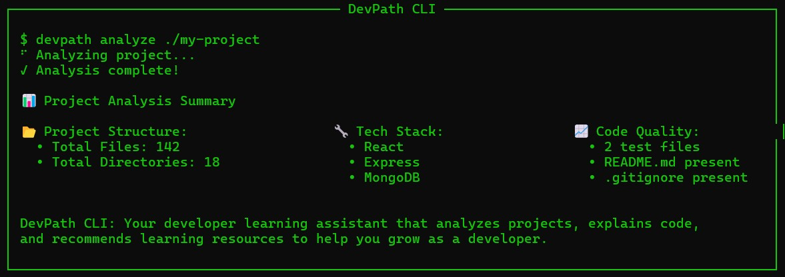

# 🛠️ DevPath CLI

*A smart learning assistant built to help developers grow — powered by Amazon Q CLI.*



## Overview

**DevPath CLI** is a command-line tool that analyzes your codebase, identifies technologies, and recommends tailored learning resources. Whether you're exploring a new project or sharpening your skills, DevPath helps you understand what you're working on — and what to learn next.

## Features

* **Project Analysis**: Detects tech stack, project structure, and code quality
* **Code Explanation**: Explains files and components at basic, intermediate, or advanced levels
* **Learning Resources**: Recommends tutorials and docs based on your stack
* **MongoDB Insights**: Recognizes database connections and explains schemas
* **React Support**: Provides detailed analysis for React JSX components

## Installation

Install globally:

```bash
npm install -g devpath-cli
```

Or install locally in your project:

```bash
npm install devpath-cli
```

## Usage

### Analyze a Project

Scan and summarize the tech stack and structure:

```bash
devpath analyze "/path/to/project"
```

**Options**

* `--depth <number>` – Set scan depth (default: 3)
* `--dir <path>` – Alternative directory path

---

### Explain Code

Break down and explain code simply:

```bash
devpath explain "/path/to/project" -f path/to/file.js -d intermediate
```

**Options**

* `-f, --file <path>` – Specify a file to explain
* `-c, --component <name>` – Focus on a specific component
* `-d, --detail <level>` – Choose explanation depth (`basic`, `intermediate`, `advanced`)

---

### Recommend Resources

Get tutorials, docs, and learning materials:

```bash
devpath recommend --list-techs
```

**Options**

* `--tech <technology>` – Recommend resources for a specific tech

---

### Interactive Learning

Start an AWS learning session:

```bash
devpath learn
```

**Options**

* `-i, --interactive` – Launch quiz-based guided learning
* `-r, --resources` – Show static resource recommendations
* `-c, --category <category>` – Focus on an AWS service area

---

## Example Output

```text
📂 Project Structure:
  • Total Files: 142
  • Total Directories: 18

🔧 Tech Stack:
  Languages:
    - JavaScript (React) (46 files)
    - JavaScript (33 files)
    - CSS (3 files)
    - HTML (2 files)

  Frameworks:
    - React
    - Express

  Tools:
    - MongoDB

📈 Code Quality Insights:
  - .gitignore detected
  - README.md present
  - 2 test files found
```

---

## Supported Technologies

### Languages

• JavaScript / TypeScript
• Python
• HTML / CSS
• Java

### Frameworks & Libraries

• React • Vue.js • Angular
• Express • Next.js • AWS CDK

### Tools & Databases

• MongoDB / Mongoose
• ESLint / Prettier
• Webpack • Jest
• Docker • AWS Services

---

## Contributing

1. Fork the repo
2. Create your feature branch:

   ```bash
   git checkout -b feature/your-feature-name
   ```
3. Commit your changes:

   ```bash
   git commit -m "Add your message here"
   ```
4. Push and open a pull request

---

## License

This project is licensed under the **MIT License**. See the [LICENSE](./LICENSE) file for details.

---

> Built with ❤️ for developers who love to learn.


---

